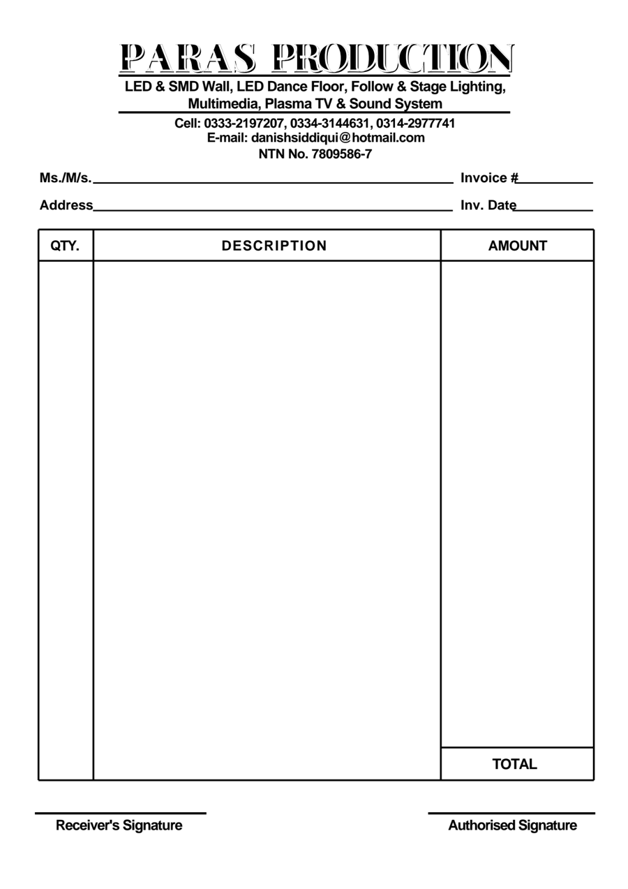

# Paras Production — invoice / bill form

A vector rebuild of the approved Paras Production invoice: three columns
(QTY. / DESCRIPTION / AMOUNT), an open description box with no row rules, and
a TOTAL cell at the foot of the amount column. Same layout and proportions as
the printed pad, but every rule is a real line and every word is real text, so
it can be edited, re-branded and re-printed without loss of quality.



## Files

| File | What it is |
| --- | --- |
| `paras-production-invoice.svg` | The editable master. Live text, named ids, self-contained (the display font is embedded). |
| `paras-production-invoice.pdf` | Flat print version, A4, fully vector with embedded fonts. |
| `paras-production-invoice-fillable.pdf` | Same page plus 50 AcroForm fields you can type into in Acrobat / Preview / any PDF reader, then print or e-mail. |
| `fonts/` | The display face used for the logotype, with its licence. |
| `tools/` | The scripts that generate all three files. |

Page size is A4 (210 × 297 mm). The drawing grid is 864 units wide, so one
unit is 0.2431 mm.

## Editing the SVG

Open it in Illustrator, Inkscape, Affinity, Figma or any text editor.

The printed form has no row rules inside the description box, so the fill-in
slots follow an **invisible 15-row grid** — entries line up neatly without
anything extra being printed. They are empty `<text>` elements with
`class="fill"` and predictable ids; type between the tags:

```xml
<text class="fill" id="f-r03-desc" x="138.5" y="441.7" text-anchor="start"></text>
<text class="fill" id="f-r03-desc" x="138.5" y="441.7" text-anchor="start">LED Dance Floor 16 x 16</text>
```

| Id | Field |
| --- | --- |
| `f-billed-to`, `f-address` | customer name and address |
| `f-invoice-no`, `f-invoice-date` | invoice number and date |
| `f-rNN-qty` \| `-desc` \| `-amount` | row `NN`, `01`–`15` |
| `f-total` | total amount (sits to the right of the TOTAL label) |

Other useful handles: `#letterhead`, `#brand-title`, `#services-1/2`,
`#phones`, `#email`, `#ntn`, `#table-grid`, `#table-head`, `#table-body`,
`#table-total`, `#signatures`.

## Notes on fidelity

* **The logotype.** The original is set in a decorative engraved face
  (Algerian-family). `font-family` asks for `Algerian` and `Engravers MT`
  first, so a machine that has the real font will use it; everything else
  falls back to Playfair Display Black, which is embedded in the SVG and in
  both PDFs. The engraved hair-line inside the letters is drawn by clipping a
  white offset stroke to the glyphs — delete the `#brand-inline` group for a
  plain solid logo.
* **`textLength`.** The logotype words, the two service lines, the three
  contact lines, the column headings, `TOTAL` and the signature captions carry
  a `textLength` so they keep the widths measured off the original — including
  the headings' slight off-centre placement, which the scan has and which was
  kept rather than "corrected". Remove the attribute from any of them if you
  change the wording and want the text to size itself.
* Body text is Arial/Helvetica Bold, matching the original.
* Everything was traced from the scan: column positions, rule weights, type
  sizes and baselines were measured, not estimated, and the result was checked
  against the original with a pixel overlay.

## Rebuilding

```sh
pip install reportlab pypdf
cd tools
python3 mksvg.py --embed     # -> ../paras-production-invoice.svg
python3 mkpdf.py             # -> ../paras-production-invoice.pdf
python3 mkpdf.py --fillable  # -> ../paras-production-invoice-fillable.pdf
```

`tools/geom.py` holds every coordinate in one place, so moving a column,
changing the row count or resizing the TOTAL cell only takes an edit there
followed by a rebuild.

Playfair Display is licensed under the SIL Open Font License 1.1 —
see `fonts/OFL.txt`.
